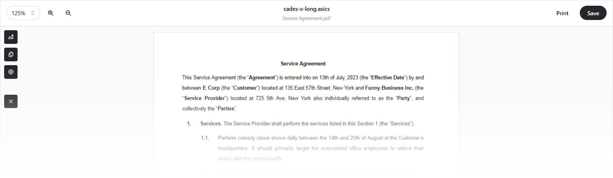

<picture></picture>

**perehliadach** (Ukrainian: переглядáч) is a desktop application for viewing and validating digitally signed documents. It supports signatures compatible with European legislation and Ukrainian European signatures.

You can open and verify ASiC files with CAdES signatures. See the [Validation Matrix](#validation-matrix) section for more information on the supported and tested formats.

## Releases

Check out the latest pre-built versions on the [Releases](https://github.com/alexnzarov/perehliadach/releases) page. They are built from the source code in this repository using GitHub Actions. 

If you want to build the application yourself, see the [Building](#building) section for instructions on how to do it.

## Components

- [perehliadach-app](./perehliadach-app): a desktop application.
- [perehliadach-cli](./perehliadach-cli): a command-line utility for validating and decoding signed documents.
- [test-cases](./test-cases): a collection of samples for testing purposes.

## Validation Matrix

| | CAdES-BES | CAdES-C | CAdES-T | CAdES-X Long |
|:---:|:---:|:---:|:---:|:---:|
|ASiC-E| ✅ | ✅ | ✅ | ✅ |
|ASiC-S| ✅ | ✅ | ✅ | ✅ |

## Building

Work in progress.